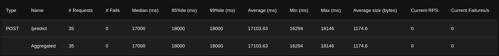
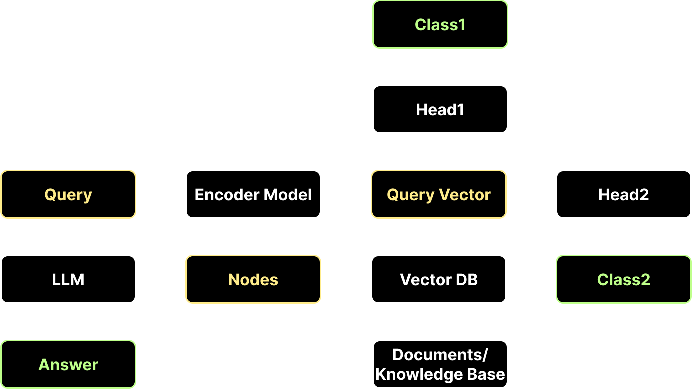

# Проект: NATASHA RUTUBE Helper

Данный проект состоит из двух основных компонентов:
1. **API на FastAPI** для предсказания ответов с помощью AI.
2. **Telegram-бот** для взаимодействия с пользователями, который отправляет запросы к API и возвращает результат.

## Структура проекта

```
api/                    # API на FastAPI
  ├── tests/            # Папка для тестов  
  │   └── locustfile.py # Скрипт для нагрузочного тестирования с использованием Locust
  ├── logger.py         # Настройка логирования для API
  ├── model.py          # Модель AI для классификации
  ├── main.py           # Главный файл для запуска API
  └── requirements.txt  # Зависимости API

tg_bot/                 # Telegram-бот на aiogram
  ├── bot_init.py       # Инициализация бота
  ├── handlers.py       # Хэндлеры для обработки сообщений и callback
  ├── logger.py         # Настройка логирования для бота
  ├── main.py           # Главный файл для запуска бота
  └── requirements.txt  # Зависимости Телеграм бота
  
ml_experiments/         # Папка для экспериментов с AI моделями
case/                   # Папка с файлами для хакатона

.env.example            # Пример файла для хранения переменных окружения
```

## 1. Запуск API

API написано на FastAPI и отвечает за классификацию и генерацию ответов на вопросы с помощью AI.

### Шаги для запуска:

1. Установите зависимости:

   ```bash
   pip install -r ./api/requirements.txt
   ```

2. Запустите сервер:

   ```bash
   python ./api/main.py
   ```

3. API запустится на `http://localhost:8975`, и при переходе автоматически произойдет редирект на документацию FastAPI, доступную по адресу `http://localhost:8975/docs`.

### Доступные эндпоинты:

- **GET `/`**: Перенаправление на документацию.
- **POST `/predict`**: 
  - Принимает JSON с вопросом:
    ```json
    {
      "question": "Ваш вопрос"
    }
    ```
  - Возвращает ответ:
    ```json
    {
      "answer": "Ответ на вопрос",
      "class_1": "Класс 1",
      "class_2": "Класс 2"
    }
    ```
  Где:
  - **answer** — ответ RAG-системы на вопрос.
  - **class_1**, **class_2** — метки классов.

### Логирование:

Логи сохраняются в формате JSONL в файле `api.log.jsonl`.

## 2. Запуск Telegram-бота

Telegram-бот отвечает за взаимодействие с пользователями и пересылает вопросы в API для получения ответа.

### Шаги для запуска:

1. Установите зависимости:

   ```bash
   pip install -r ./tg_bot/requirements.txt
   ```

2. Создайте файл `.env` с переменной **BOT_TOKEN**, которая будет содержать токен вашего Telegram-бота. Пример файла `.env` приведен в `.env.example`.

   Для создания файла `.env` с переменной **BOT_TOKEN**, выполните следующую команду:

   ```bash
   echo BOT_TOKEN=<Ваш_токен> > ./tg_bot/.env
   ```

   Токен для бота можно получить в Telegram у [BotFather](https://t.me/BotFather).

3. Запустите Telegram-бота:

   ```bash
   python ./tg_bot/main.py
   ```

### Как работает бот:

- Бот принимает любое сообщение от пользователя.
- Пересылает это сообщение в API по адресу `/predict`.
- Получает ответ от API и возвращает пользователю значение из поля `"answer"`.
- Можно оставить оценку ответу "👍" или "👎" для дальнейшего улучшения качества модели.

## 3. Нагрузочное тестирование API

Для проверки производительности API используется инструмент Locust.

### Шаги для запуска нагрузочного тестирования:

1. Запустите нагрузочное тестирование:

   ```bash
   locust -f ./api/tests/locustfile.py --host http://localhost:8975
   ```

2. Откройте веб-интерфейс Locust в браузере по адресу: http://localhost:8089, чтобы запустить и контролировать тестирование.

### Результаты тестирования:

 - Средняя пропускная способность решения составила 17 секунд на запрос

<p align="center" width="100%">
    
</p>

## 4. Inference ML Design
(Need dark theme)

<p align="center" width="100%">
    
</p>
